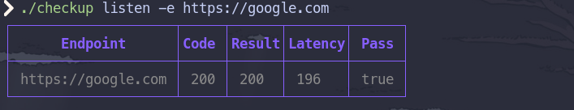
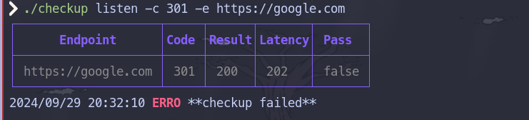
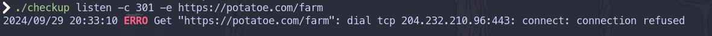
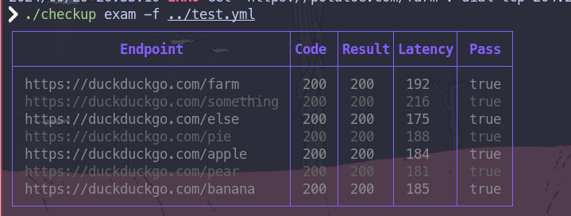

<h1 align="center">Checkup</h1>
<p>CLI to run simple health checks against endpoints</p>
<p>
  <a href="https://opensource.org/licenses/MIT">
    
  </a>
</p>

<p align="center">
  
</p>

---
## Example Usage :

Note that we introduced styling from https://github.com/charmbracelet/lipgloss

##### Default usage with `listen`





##### Passing a File with `exam`



##### Local usage with environment variables

```bash
# Basic Authentication with env vars
# CU_USER=admin CU_PASS=pass
$ checkup listen -e http://localhost:8080 -a
```

## Exam File Example :

### Yaml
``` yaml
name: Test Name
endpoint: https://duckduckgo.com
tests:
  - code: 200
    paths:
      - /farm
      - /something
      - /else
  - code: 404
    paths:
      - /this
      - /not
      - /found
```

``` json
{
  "name": "Exam Name",
  "endpoint": "https://google.com",
  "tests": [
    {
      "code": 200,
      "paths": [
          "/farm",
          "/something",
          "/else"
      ]
    },
    {
      "code": 404,
        "paths": [
          "/this",
          "/not",
          "/found"
      ]
    }
  ]
}
```
