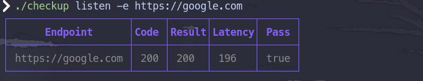
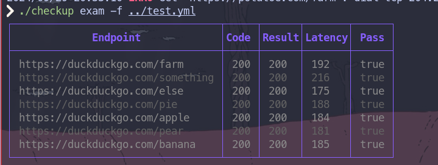

<h1 align="center">Checkup</h1>
<p>CLI to run simple health checks against endpoints</p>
<p>
  <a href="https://opensource.org/licenses/MIT">
    
  </a>
</p>

<p align="center">
  
</p>

---

## Installation

### Quick Install (One-liner)

> Make sure `~/bin` exists and is in your `$PATH`. Run once if needed:
> ```bash
> mkdir -p ~/bin && echo 'export PATH="$HOME/bin:$PATH"' >> ~/.zshrc && source ~/.zshrc
> ```
> For bash, replace `~/.zshrc` with `~/.bashrc`.

**macOS (Apple Silicon — arm64)**
```bash
curl -L https://github.com/JoseThen/checkup/releases/download/v0.8.0/checkup-v0.8.0-darwin-arm64 -o ~/bin/checkup && chmod +x ~/bin/checkup
```

**macOS (Intel — amd64)**
```bash
curl -L https://github.com/JoseThen/checkup/releases/download/v0.8.0/checkup-v0.8.0-darwin-amd64 -o ~/bin/checkup && chmod +x ~/bin/checkup
```

**Linux (amd64)**
```bash
curl -L https://github.com/JoseThen/checkup/releases/download/v0.8.0/checkup-v0.8.0-linux-amd64 -o ~/bin/checkup && chmod +x ~/bin/checkup
```

**Linux (arm64)**
```bash
curl -L https://github.com/JoseThen/checkup/releases/download/v0.8.0/checkup-v0.8.0-linux-arm64 -o ~/bin/checkup && chmod +x ~/bin/checkup
```

---

### Manual Install

1. Go to the [Releases page](https://github.com/JoseThen/checkup/releases) and download the binary for your platform:

   | Platform | Architecture          | Filename                       |
   | -------- | --------------------- | ------------------------------ |
   | macOS    | Apple Silicon (arm64) | `checkup-v0.8.0-darwin-arm64`  |
   | macOS    | Intel (amd64)         | `checkup-v0.8.0-darwin-amd64`  |
   | Linux    | amd64                 | `checkup-v0.8.0-linux-amd64`   |
   | Linux    | arm64                 | `checkup-v0.8.0-linux-arm64`   |
   | Linux    | arm                   | `checkup-v0.8.0-linux-arm`     |
   | Linux    | 386                   | `checkup-v0.8.0-linux-386`     |
   | Windows  | amd64                 | `checkup-v0.8.0-windows-amd64` |
   | Windows  | 386                   | `checkup-v0.8.0-windows-386`   |

2. Move the binary to `~/bin/` and rename it:
   ```bash
   mkdir -p ~/bin
   mv ~/Downloads/checkup-v0.8.0-<OS>-<ARCH> ~/bin/checkup
   ```

3. Make it executable (macOS and Linux only):
   ```bash
   chmod +x ~/bin/checkup
   ```

4. Ensure `~/bin` is in your `$PATH` (add to `~/.zshrc` or `~/.bashrc` if needed):
   ```bash
   export PATH="$HOME/bin:$PATH"
   ```

5. Verify the install:
   ```bash
   checkup --help
   ```

#### Windows

1. Download `checkup-v0.8.0-windows-amd64.exe` (or `windows-386`) from the [Releases page](https://github.com/JoseThen/checkup/releases).
2. Move it to a folder of your choice (e.g. `C:\Users\<you>\bin\`).
3. Add that folder to your system `PATH` via **System Properties → Environment Variables → Path**.
4. Open a new terminal and run `checkup --help` to verify.

---

## Example Usage :

Note that we introduced styling from https://github.com/charmbracelet/lipgloss

##### Default usage with `listen`




##### Passing a File with `exam`



##### Local usage with environment variables

```bash
# Basic Authentication with env vars
# CU_USER=admin CU_PASS=pass
$ checkup listen -e http://localhost:8080 -a
```

## Exam File Example :

### Yaml
``` yaml
name: Test Name
endpoint: https://duckduckgo.com
tests:
  - code: 200
    paths:
      - /farm
      - /something
      - /else
  - code: 404
    paths:
      - /this
      - /not
      - /found
```

``` json
{
  "name": "Exam Name",
  "endpoint": "https://google.com",
  "tests": [
    {
      "code": 200,
      "paths": [
          "/farm",
          "/something",
          "/else"
      ]
    },
    {
      "code": 404,
        "paths": [
          "/this",
          "/not",
          "/found"
      ]
    }
  ]
}
```
